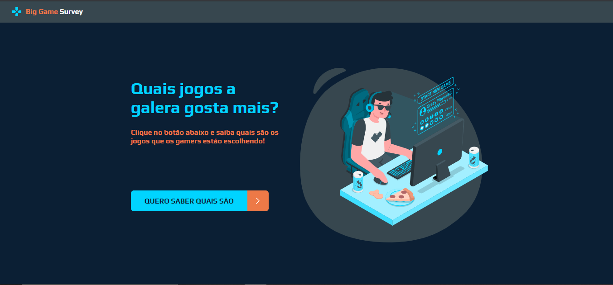
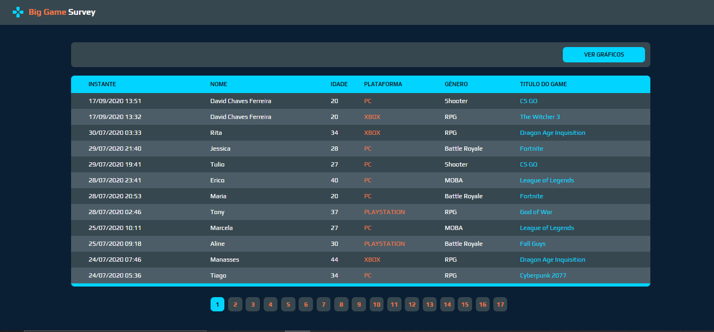
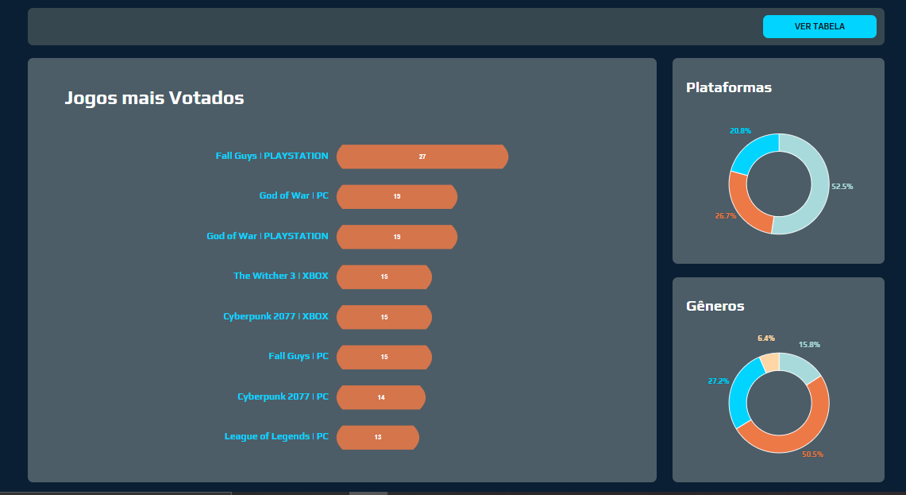

# Semana Dev Superior (SDS) :iphone: :computer:


A semana dev-superir foi uma semana que aconteceu entre os dias 14/09/2020 e 20/09/2020, durante esta semana nós desenvolvemos um projeto utilizando as tecnologia React e Spring Boot. O objetivo deste projeto foi alavancar a nossa carreira como dev, praticando e desenvolvendo com boas praticas de programação 


# Projeto :video_game: :bow_and_arrow: 

O projeto consiste em saber quais os jogos que a galera mais curti. 
O sistema devolve uma tabela com todas os registros com o nome e os jogos que a galera votou, além da tabela
também é apresentado graficos com as quantidades e percentuais dos jogos, plataforma e gêneros mais votados


# Links 

- Projeto web: https://sds1-big-game-survey.netlify.app
- Projeto backend: https://sds1-big-game-survey.herokuapp.com


*obs: quando for acessar o projeto web na tela de graficos ou nos registros esperar pelo menos 2 minutos até aparecer a tabela e os graficos, pois como não foi utilizado uma hospedagem paga, a aplicação tem um pequeno delay, o mesmo serve para quando você for fazer uma requisição direta na API*
### Rotas da API
```
  Games
    GET: /games
    
  Records
    GET: /records?maxDate=?&minDate?&linesPerPage=?&page=?&orderBy=?&direction=?
    POST: /records
    { 
      "customer" : ? 
      "age" : ?
      "gameId" : ?
    }
```

# Preview

 
 
 

# Tecnologias :rocket: 

- [X] Spring Boot
- [X] Java 11
- [X] PostgreSQL
- [X] React JS 
- [X] TypesCript

